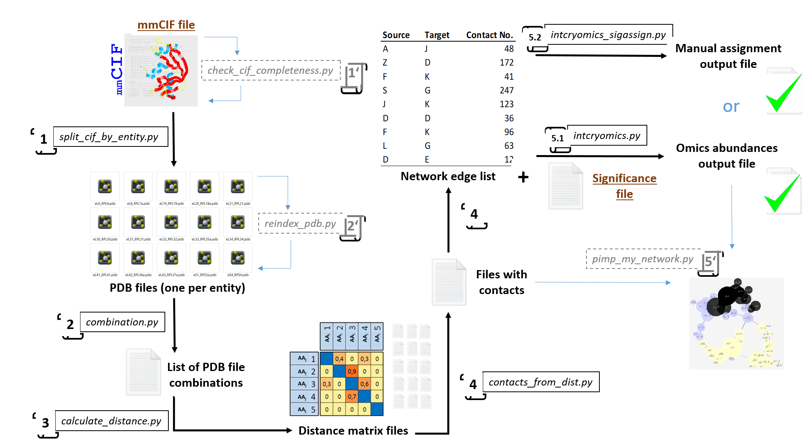

# Protein-Complex-Partitioner
**Integration of omics relative changes into sampled interaction networks translated from cryogenic or crystallographic based atomic structures of multiprotein complexes.**
## Introduction
Protein-Complex-Partitioner is a collection of scripts to randomly select spatial neighborhoods of proteins from a multiprotein complex in order to test whether these neighbors characterize a region within the complex that becomes significantly enriched upon any experimental procedure. The procedure has been detailed in XXXXX and XXXXX publication.

The repo follows this file structure, in order of relevance:

1. [Usage Instructions](https://github.com/MSeidelFed/Protein-Complex-Partitioner/blob/master/USAGE.md): _detailed and recommended usage of python and bash script code to run the analysis step-by-step._
2. [Data](https://github.com/MSeidelFed/Protein-Complex-Partitioner/tree/master/Data): _sample data used in the original project from which the usage examples are based. Use  this to reproduce our results._
3. [Python_Modules](https://github.com/MSeidelFed/Protein-Complex-Partitioner/tree/master/Python_Modules): _collection of python scripts to carry out various steps of the analysis._
4. [Batch_files](https://github.com/MSeidelFed/Protein-Complex-Partitioner/tree/master/Batch_files): _collection of bash scripts to run certain parts of the workflow in batch, iterating over a large number of files._
5. [Images](https://github.com/MSeidelFed/Protein-Complex-Partitioner/tree/master/images): _some figures relevant to the repo_

Below is an illustration of the workflow. Current work is in progress to develop the modules further into one connected pipeline. 

**Workflow**



mmCIF icon was taken from [IUCr](http://ww1.iucr.org/)


## Installation

Clone the repo:
```
git clone https://github.com/MSeidelFed/Protein-Complex-Partitioner.git
```
Create a virtual environment. This step is optional
```
pip install --user virtualenv
virtualenv venv
source venv/bin/activate
```
Install python dependencies
```
pip install -r requirements.txt
```
