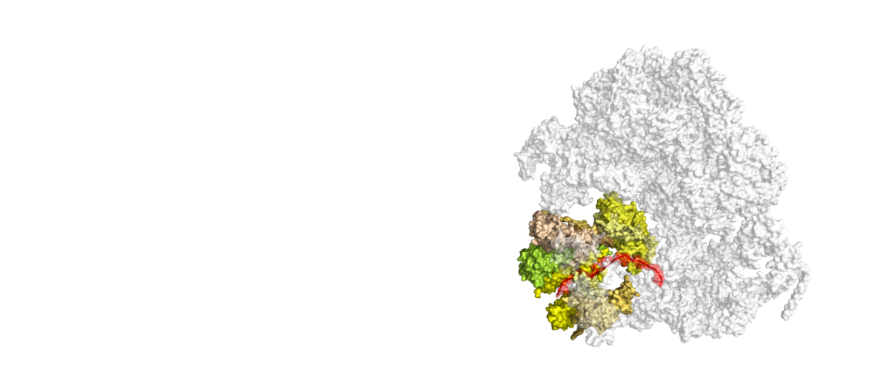
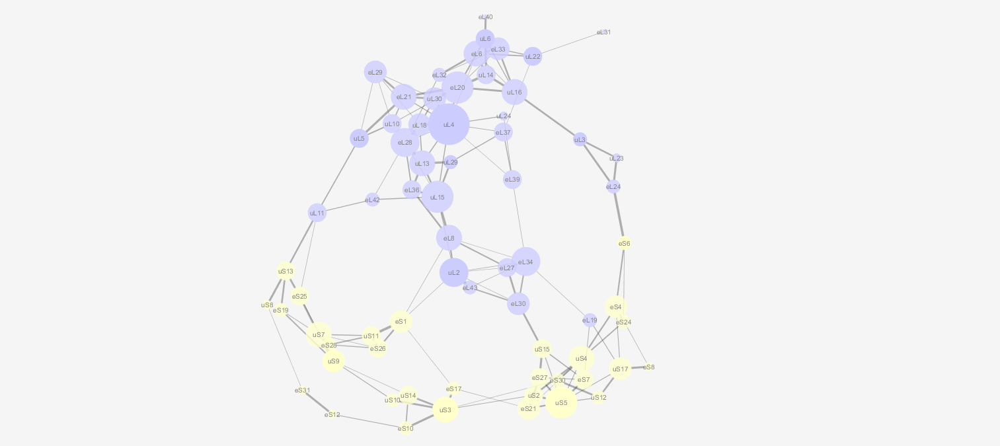
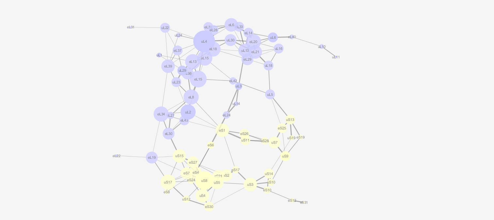

# IntCryOmics USAGE.md
This is the usage file for the integration of omics relative changes into Cryo-EM based randomly sampled interaction networks of multiprotein complexes. The project is composed of independent components, written as python scripts (found in [Python_Modules](https://github.com/MSeidelFed/IntCryOmics/tree/master/Python_Modules)), which can be run in batch with bash scripts (found in [Batch_files](https://github.com/MSeidelFed/IntCryOmics/tree/master/Batch_files)). 

Here we document the usage of the various modules, with an example using the yeast and rabbit ribosomal protein complexes, with rRNA removed (*Saccharomyces cerevisiae* PDB ID: [6snt](https://www.rcsb.org/structure/6SNT)) (*Oryctolagus cuniculus* PDB ID: [6gz5](https://www.rcsb.org/structure/6GZ5)).


## Usage
**In the sections below, we describe the workflow from data generation to output. Code should be run from the command line, Linux-style.**
**Individual python scripts can all be run with the -h or --help flag to get the usage.**

For example, running ```python3 reindex_pdb.py -h``` in the command line gives:
```sh
usage: python3 reindex_pdb.py [-h] <startidx> <pdbfile> <outfile>

Returns PDB file with residues reindexed according to start index

positional arguments:
  startidx    Starting index, usually 1
  pdbfile     PDB file to be reindexed
  outfile     Reindexed PDB file

optional arguments:
  -h, --help  show this help message and exit
```

### _Dependencies_
All code for this project is written for Python version 3 and above. Running on an older version of Python will not work! If you are working with a modular server system, don't forget to load the correct module.
```bash
$ module add devel/Python-3.6.5
```

Otherwise make sure you have Python 3 installed. Additionally, we use the Biopython PDB package to handle PDB files. Installation info can be found [here](https://biopython.org/wiki/Download).

## Extract PDB files from mmCIF files

Many multiprotein complexes are given in mmCIF-formatted files. Here is how to use the command line (linux-like) to extract PDBs from mmCIF files, which we save into the trial directory.
_e.g.:_

**1. Make directory to store PDB objects**
```bash
$ mkdir trial_6snt

$ mkdir trial_6gz5
```
**2. Extract PDB objects from the mmCIF entity**

_Usage:_ ```python3 <path_to_function> <path_to_mmCIF> <output_path>```

```bash
$ python3 Python_Modules/split_cif_by_entity.py Data/6snt.cif trial_6snt/

$ python3 Python_Modules/split_cif_by_entity.py Data/6gz5.cif trial_6gz5/
```

The PDB objects will be saved as individual files in the `trial_6snt` directory. RNA and other non-protein objects need to be manually taken out of the folder before proceeding.

## Generate FASTA files (optional)

This module is optional within the entire workflow and is meant as a quality control step in order to align the monomer sequences of the constituent molecular entities in the analyzed multimeric complex.
_e.g.:_

**1. Grabbing entity number from original mmCIF**
```bash
$ grep "L30" Data/6snt.cif

$ grep "L30" Data/6gz5.cif
```
**2. Grabbing the sequences and generating the FASTA**

_Usage:_ ```python3 <path_to_function> <path_to_PDB> <path_to_mmCIF> <entity_number> <entity_type> <output_path>```
```bash
$ python3 Python_Modules/extract_sequence.py trial_6snt/6snt_L30_60S_ribosomal.pdb Data/6snt.cif 64 protein .

$ python3 Python_Modules/extract_sequence.py trial_6gz5/6gz5_uL30_ribosomal.pdb Data/6gz5.cif 46 protein .
```

The function will output the sequences of the mmCIF object according to the entity number (64 and 46 in the example) and type (protein in the example), it will only consider the sequences a match if every single monomer is listed in both strings in which case no further message will be displayed, otherwise a warning message will tell the user that the sequences are not equal and a visual verification becomes necessary.

## Reindex PDBs (optional)

The residues column inside PDBs can be reindexed (sequential incrementation) if there are inconsistencies in numbering to prevent holes in structures, or if for any other reason the user wishes to start from a certain index. For our examplary name files to work RNA and other non-protein objects need to be manually taken out of the folder containing the PDBs before proceeding.

_e.g.:_

**1. make new directory to store reindexed PDBs**
```bash
$ mkdir redxd_6snt

$ mkdir redxd_6gz5
```
**2a. BATCH version: reindexing objects with a bash script**

- Make a 2-column names file, if you create the names file with excel you might want to getrid of the carriage returns, e.g.:
```bash
$ tr -d '\r' < names_6snt.txt

$ tr -d '\r' < names_6gz5.txt
```
- The file needs to have, per line, the input pdb file, followed by a whitespace and the output file name: ```file.pdb file_reindex.pdb```.

_Usage:_ ```bash Batch_files/batch_reindex_PDBs.sh <pathtopythoncode> <pathto/infile> <pathtopdbs> <outpath> <startingreindexnumber>```

- Make sure your input paths to directories include the final slash `/`

```bash
$ bash Batch_files/batch_reindex_PDBs.sh Python_Modules/ Data/names_6snt.txt trial_6snt/ redxd_6snt/ 1

$ bash Batch_files/batch_reindex_PDBs.sh Python_Modules/ Data/names_6gz5.txt trial_6gz5/ redxd_6gz5/ 1
```
**2b. SINGLE version: reindexing one by one**

_Usage:_ ```python3 reindex_pdb.py [-h] <startidx> <pdbfile> <outfile>```
```bash
$ python3 Python_Modules/reindex_pdb.py 1 trial_6snt/6snt_L30_60S_ribosomal.pdb redxd_6snt/uL30_rpL7.pdb

$ python3 Python_Modules/reindex_pdb.py 1 trial_6gz5/6gz5_uL30_ribosomal.pdb redxd_6gz5/uL30_rpL7.pdb
```

After iterating through every object the output, reindexed PDBs should be in the trial_redxd folder. At this point you may select which object to include to fit the distance network. In our exemplary case we only used the protein PDBs to fit the network, hiding the remaining PDB files in a separate folder.

## Fit the distance network

Generate file with the combinations of names that will be used to calculate distance matrices between entities
_e.g.:_

**1. Make new text file with the names of reindexed objects that will be used for the network**
```bash
$ ls redxd_6snt > infile_6snt.txt

$ ls redxd_6gz5 > infile_6gz5.txt
```
**2. Generate file with the combinations of names that will be used to calculate distance matrices between entities**

_Usage:_ ```python3 combination.py [-h] <inputfile> <N> <outfile> <outpath```
```bash
$ python3 Python_Modules/combination.py infile_6snt.txt 2 combi_names_6snt.txt .

$ python3 Python_Modules/combination.py infile_6gz5.txt 2 combi_names_6gz5.txt .
```
The N here is your combination base value, so use 2. 

Calculate a distance matrix between entities using reindexed PDBs as input, the file with names conminations as future relationships in the matrix and a bash script to iterate the process between each pair of PDB files. Alternatively one can do each pair individually without using the shell script to run in batch.
_e.g.:_
**3. Make new directory to store distance matrices**
```bash
$ mkdir DistMat_6snt

$ mkdir DistMat_6gz5
```
**4. Calculating distance matrices between objects with a bash script**

_Usage:_ ```bash Batch_files/batch_calc_dist.sh <pathtopythoncode> <pathto/infile> <pathtopdbs> <outpath>```
```bash
$ bash Batch_files/batch_calc_dist.sh Python_Modules/ combi_names_6snt.txt redxd_6snt/ DistMat_6snt/

$ bash Batch_files/batch_calc_dist.sh Python_Modules/ combi_names_6gz5.txt redxd_6gz5/ DistMat_6gz5/
```
In this case your ```combi_names.txt``` file should be a two column file where you list ```file1 file2``` with a whitespace inbetween.

**5. Calculating distance matrices one by one**

_Usage:_ ```python3 calculate_distance.py [-h] <pathto/PDBfile1> <pathto/PDBfile2> <outpath>```
```bash
$ python3 Python_Modules/calculate_distance.py redxd_6snt/uL30_RPL7.pdb redxd_6snt/uL4_RPL4.pdb .

$ python3 Python_Modules/calculate_distance.py redxd_6gz5/uL30_RPL7.pdb redxd_6gz5/uL4_RPL4.pdb .
```
Please note that the function expects a naming scheme of the form XX_XX.pdb, which should be arranged in the file_names.txt so that the reindexed objects align with such a scheme. The function then grabs the characters before the underscore as the ID of the resulting .csv matrix. 
The resulting distance matrices can be imported into R for visualization.


## Threshold selection and transit probability

Select a threshold to define a contact and build a contact matrix based on the distances. Plus output the number of atoms that are in contact to later on define the percentage of coverage and transit probability.
_e.g.:_

**1. Make new directory to store contact matrices**
```bash
$ mkdir contacts_6snt_t12

$ mkdir contacts_6gz5_t12
```
**2. Make a list with the generated csv matrices**
```bash
$ ls DistMat_6snt/ > csv_names_file_6snt.txt

$ ls DistMat_6gz5/ > csv_names_file_6gz5.txt
```
**3. Calculate contact number among entities according to a defined threshold**

_Usage:_ ```python3 contacts_from_dist.py <threshold> <pathtoinput> <pathtocsvs> <pathtopdbs> <pathtooutput>```
```bash
$ python3 Python_Modules/contacts_from_dist.py 12 csv_names_file_6snt.txt DistMat_6snt/ redxd_6snt/ contacts_6snt_t12/

$ python3 Python_Modules/contacts_from_dist.py 12 csv_names_file_6gz5.txt DistMat_6gz5/ redxd_6gz5/ contacts_6gz5_t12/
```

The function will take the first text portion from the proposed nameing scheme (XX_XX) and map the contacts using the reindexed PDBs, whenever it encounters a redundance in terms of naming, the user will need to input manually the number of the evaluated RP given a list of options. After iteration through all the files in the csv_names_file.txt several outputs are produced:

Output 1: summary contacts =   eL37 eL39 10 514 161 First two columns determine whether a contact exists. third is the number of residues in contact, fourth is the number of conections between atoms, and last the number of atoms conected.

Output 2: contacts_t8_eL37_eL39_full.dat = 17 51 7.129363 49 18 First is residue # from first protein, second is residue # from second protein and third is distance between them, fourth number of conections between atoms and fifth number of atoms conected. The file named "contacts_t8_eL37_eL39.dat" does not contain the last two columns

The first two columns of Output 1 are used to fit the network, and in order to prepare the edgelist for the random walk, one must also create an edges_with_weights.txt file, containing the numbers of amino acids in contact as well as the nodes in contact. This is simply:

**4. Store results**
```bash
$ mkdir Results
```

```
$ awk '{print $1" "$2" "$3}' contacts_6snt_t12/summary_contacts_t12.txt > Results/edges_with_weights_6snt_t12.txt

$ awk '{print $1" "$2" "$3}' contacts_6gz5_t12/summary_contacts_t12.txt > Results/edges_with_weights_6gz5_t12.txt
```

## Random Walk and Fisher Exact Test

The user must input a significances file for the hypergeometric or Fisher exact test with the same protein identifiers as those in the edge list and binary calls where 1 is significant for condition X and 0 is not significant, both columns must be separated by a space " ". The module allows repeated protein identifiers, or in other words, multiple significances per identifier in separate lines. This feature is meant to cope with paralogs within protein families, which are characteristic of multiprotein complexes. The example output is listed below:
_e.g.:_

_Usage:_ ```python3 intcryomics.py <filewithedgelist> <sigfile> <walklength> <iterationnum>```
```bash
# 6gz5
## total significantly changed rProteins (WL = 13%, t = 12, BS = 22%, RAS = 4)
$ python3 Python_Modules/intcryomics.py edges_with_weights_6gz5_t12.txt Data/significance_file_6gz5 10 50 > Results/IntCryOmics_6gz5_t12_WL10_BP22.txt

## total substoichiometric rProteins (WL = 33%, t = 12, BS = 8%, RAS = 13)
$ python3 Python_Modules/intcryomics.py edges_with_weights_6gz5_t12.txt Data/significance_file_6gz5_SbSt 26 50 > Results/IntCryOmics_6gz5_t12_WL26_BP8.txt

#6snt
## total significantly changed rProteins (WL = 13%, t = 12, BS = 15%, RAS = 7)
$ python3 Python_Modules/intcryomics.py edges_with_weights_6snt_t12.txt Data/significance_file_6snt 9 50 > Results/IntCryOmics_6snt_t12_WL9_BP15.txt

## enriched rProteins (WL = 33%, t = 12, BS = 7%, RAS = 14)
$ python3 Python_Modules/intcryomics.py edges_with_weights_6snt_t12.txt Data/significance_file_6snt_enriched 24 50 > Results/IntCryOmics_6snt_t12_WL24_BP7_enr.txt

## depleted rProteins (WL = 33%, t = 12, BS = 7%, RAS = 14)
$ python3 Python_Modules/intcryomics.py edges_with_weights_6snt_t12.txt Data/significance_file_6snt_depleted 24 50 > Results/IntCryOmics_6snt_t12_WL24_BP7_dep.txt
```

## Significant results example: 6SNT depleted rProteins
### List of nodes

['eL19', 'eL34', 'eS7', 'uS17', 'eL20', 'eL21', 'eL33', 'uL10', 'uL14', 'uL16', 'uL30', 'uL4', 'uL6', 'eL29', 'uL5', 'eL24', 'eS6', 'uL23', 'uL3', 'eL27', 'eL30', 'eL8', 'uL2', 'eL28', 'eL32', 'eL36', 'eL42', 'uL13', 'uL15', 'uL18', 'eL43', 'uS15', 'eL31', 'uL22', 'eL6', 'eL39', 'eL37', 'uL29', 'uL24', 'eL40', 'uL11', 'eS1', 'eS10', 'eS12', 'uS14', 'uS3', 'eS31', 'eS17', 'eS21', 'eS19', 'uS13', 'uS7', 'uS9', 'eS26', 'uS11', 'eS27', 'uS2', 'uS4', 'uS5', 'eS24', 'eS4', 'eS25', 'eS28', 'eS30', 'uS12', 'uS8', 'eS8', 'uS10']

### Minumum covering set
_i.e., smallest set that spans the entire node space, gives preference to larger subsets_

[{0, 64, 2, 3, 66, 1, 48, 19, 20, 55, 56, 57, 58, 60, 63, 31}, {35, 4, 5, 38, 36, 37, 8, 10, 11, 21, 23, 25, 27, 28, 29}, {67, 41, 44, 45, 49, 50, 51, 52, 53, 54, 61, 62}, {33, 34, 4, 6, 8, 9, 11, 12, 15, 18, 23, 24, 27, 29}, {34, 4, 5, 7, 8, 9, 10, 11, 40, 13, 14, 50, 29}, {67, 42, 43, 44, 45, 46, 47, 51, 52}, {4, 8, 9, 15, 16, 17, 18, 59, 60}, {1, 19, 20, 21, 22, 55, 58, 28, 30, 31}, {65, 4, 5, 40, 14, 49, 50, 51, 52, 26, 27, 28, 61}, {34, 4, 5, 6, 39, 8, 9, 10, 11, 12, 14, 15, 18}, {32, 33, 34, 4, 5, 6, 8, 9, 12, 24}]


### Sampled Regions

_i.e., most visited nodes during the random walks starting from the first node_

Region 0:	['eL19', 'uS12', 'eS7', 'uS17', 'eS8', 'eL34', 'eS21', 'eL27', 'eL30', 'eS27', 'uS2', 'uS4', 'uS5', 'eS4', 'eS30', 'uS15']

Region 1:	['eL39', 'eL20', 'eL21', 'uL24', 'eL37', 'uL29', 'uL14', 'uL30', 'uL4', 'eL8', 'eL28', 'eL36', 'uL13', 'uL15', 'uL18']

Region 2:	['uS10', 'eS1', 'uS14', 'uS3', 'eS19', 'uS13', 'uS7', 'uS9', 'eS26', 'uS11', 'eS25', 'eS28']

Region 3:	['uL22', 'eL6', 'eL20', 'eL33', 'uL14', 'uL16', 'uL4', 'uL6', 'eL24', 'uL3', 'eL28', 'eL32', 'uL13', 'uL18']

Region 4:	['eL6', 'eL20', 'eL21', 'uL10', 'uL14', 'uL16', 'uL30', 'uL4', 'uL11', 'eL29', 'uL5', 'uS13', 'uL18']

Region 5:	['uS10', 'eS10', 'eS12', 'uS14', 'uS3', 'eS31', 'eS17', 'uS7', 'uS9']

Region 6:	['eL20', 'uL14', 'uL16', 'eL24', 'eS6', 'uL23', 'uL3', 'eS24', 'eS4']

Region 7:	['eL34', 'eL27', 'eL30', 'eL8', 'uL2', 'eS27', 'uS5', 'uL15', 'eL43', 'uS15']

Region 8:	['uS8', 'eL20', 'eL21', 'uL11', 'uL5', 'eS19', 'uS13', 'uS7', 'uS9', 'eL42', 'uL13', 'uL15', 'eS25']

Region 9:	['eL6', 'eL20', 'eL21', 'eL33', 'eL40', 'uL14', 'uL16', 'uL30', 'uL4', 'uL6', 'uL5', 'eL24', 'uL3']

Region 10:	['eL31', 'uL22', 'eL6', 'eL20', 'eL21', 'eL33', 'uL14', 'uL16', 'uL6', 'eL32']


### Significances:

#### Total number significant proteins: 

9

#### Significant regions Fisher exact test: 
_given per region, in order_

[0.20677975058407394, 0.20190100419339496, 4.454548445974411e-05, 0.20756462375130572, 0.6599924855816629, 0.05266692989130473, 0.5983871163800559, 0.6030541774129478, 0.6852495694345174, 0.6852495694345174, 0.35465389045913565]


#### Significant regions after Bonferroni correction: 

1. Logical array: [False, False,  True, False, False, False, False, False, False, False, False]

2. Significances array: [1.00000000e+00, 1.00000000e+00, 4.90000329e-04, 1.00000000e+00, 1.00000000e+00, 5.79336229e-01, 1.00000000e+00, 1.00000000e+00, 1.00000000e+00, 1.00000000e+00, 1.00000000e+00]


_Significantly modulated region_ 

## Network drawing and highlight of specific regions

In order to color nodes, the following script allows users to map the subunit belonging of each node in the source and target columns, plus an optional argument is to select all the nodes that interact after the random walk with an specific protein of interest.
_e.g.:_

_Usage:_ ```python3 pimp_my_network.py <Names_file> [Intcryomics_file] [protein_ID] ```
```bash

## names file
ls Results/edges* > Network_names_file.txt

## IntCryOmics names file
ls Results/IntCryOmics_* > IntCryOmics_names_file.txt

$ python3 Python_Modules/pimp_my_network.py Network_names_file.txt IntCryOmics_names_file.txt eL39
```

If an IntCryOmics names file and a protein identifier are not given, the nodes will be named based on the subunit they belong to, either SSU or LSU. This procedure generates as outcome text files with a network structure that can be then visualized. The following is an example that was visualized in [Cytoscape](https://cytoscape.org/) using the protein eL39 as an example to follow the polypeptide exit tunnel (PET) region at different distance thresholds:


_Optimized yeast network_
_Optimized rabbit network_ 


